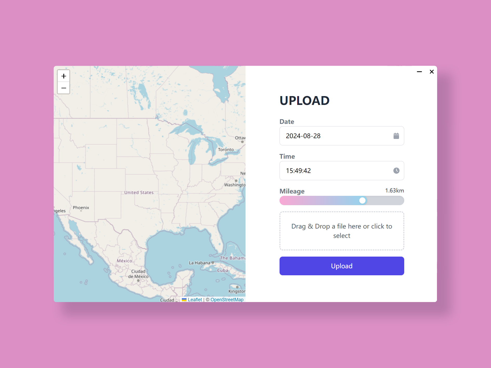

<!-- markdownlint-configure-file
MD033:
  allowed_elements: [img, h1]
 -->

<h1 align=center>
    
    Pretty Der6y
</h1>



A third-party running data upload client.

## Installation

You can find the latest release [here](https://github.com/yaoshiu/pretty-der6y/releases/latest).

### Build From Source

You can build the project from source by the following steps.

#### Prerequistes

- Rust toolchain including `rustc` and `cargo`.
- A JavaScript runtime ([bun](bun.sh) recommended).
- For more information, check the [Tauri v2 documentation](https://v2.tauri.app/start/prerequisites/).

#### Build Steps

```bash
# Clone the registry
git clone https://github.com/yaoshiu/pretty-der6y.git

# Move to the directory for the client application
cd tauri-app

# Install frontend dependencies
bun install

# Build the application
bun tauri build
```

## Usage

### Custom Route File

The route file is in [GEOJSON](geojson.org) format. Route files for _Pretty Der6y_ should contain exactly **ONE** feature with a **SINGLE** `LineString`.

You can create your route in [georoute.io](georoute.io).

Check our example route file [here](./assets/map.geojson).

## Credits

Special thanks to:

- The [Tauri](tauri.app) toolkit.

- The [Solid](solidjs.com) framework.

- The [TailwindCSS](tailwindcss.com).

The background image for the login page is from [Nardack - Pixiv](https://www.pixiv.net/artworks/89657320). **Modification and distribution without the permission of the author is prohibited**.

## License

This project is licensed under the AGPL-3.0 License.

You can modify and redistribute this software freely, but make sure the source code is available to public.

See the [LICENSE](./LICENSE) file for details.
